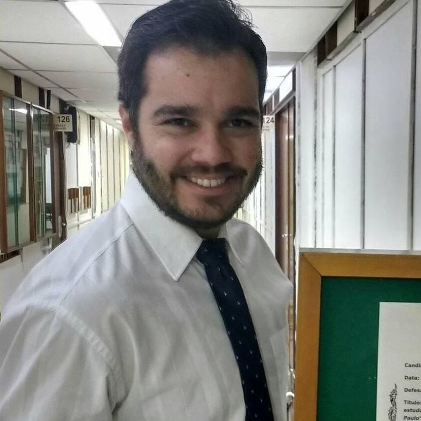

<link rel="stylesheet" href="styles.css" type="text/css">

Hello World!

My name is **Murilo de Oliveira Junqueira**. I am Political Science professor at the Federal University of Pará ([UFPA](https://portal.ufpa.br/)), Brazil, and a master and PhD in political science from the University of São Paulo (USP). My research interests are:

&nbsp;

&nbsp;

**Substantive:** political institutions, public policy, public administration, political economy and philosophy of the social sciences.

**Methodological:** computational social sciences, quantitative methods in political science, integration between quantitative and qualitative methods.

&nbsp;

Here is my [Lattes Curriculum](http://lattes.cnpq.br/2764182741921334) and my [Google Scholar](https://scholar.google.com.br/citations?user=qQjZMZIAAAAJ).

&nbsp;

This is my professional website. I use it to show my studies, research and professional experiences. If you want to know my opinion on non-professional subjects, see the blog:

[Em Busca de um Mundo Melhor - Blog de Política (_In Search of a Better World - A Blog about Politics_)](https://embuscadeummundomelhor.wordpress.com/)

&nbsp;

